# Architecture Diagrams

Visual flowcharts and diagrams illustrating the system architecture, request flow, and key processes.

## Table of Contents

1. [Request Flow](#request-flow)
2. [Plugin Lifecycle](#plugin-lifecycle)
3. [UI Component Resolution](#ui-component-resolution)
4. [Data Flow Examples](#data-flow-examples)
5. [Runtime Comparison](#runtime-comparison)

## Request Flow

### Workers Request Flow (Edge Computing)

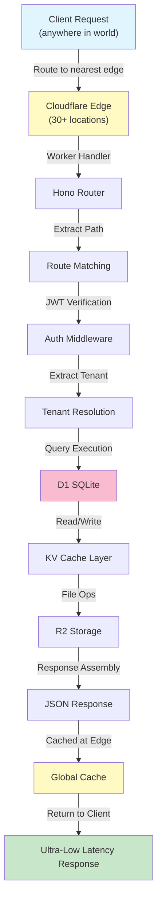

**Key Points:**
- Request handled at edge closest to user
- D1 database is centralized (request goes to DB region)
- KV cache is distributed (cache at each edge)
- Response returns from nearest edge location

### Express Request Flow (Traditional)

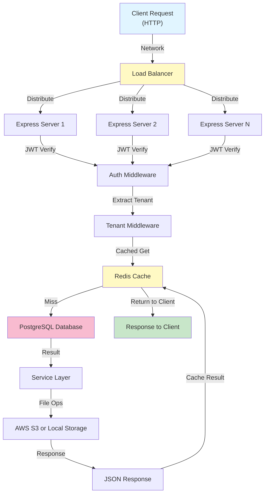

**Key Points:**
- Multiple Express instances behind load balancer
- Redis provides in-process cache
- All instances access same PostgreSQL
- Horizontal scaling via more instances

## Plugin Lifecycle

### Plugin Installation & Activation

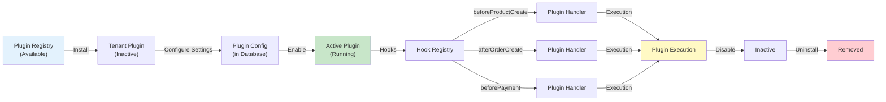

### Plugin Execution Flow

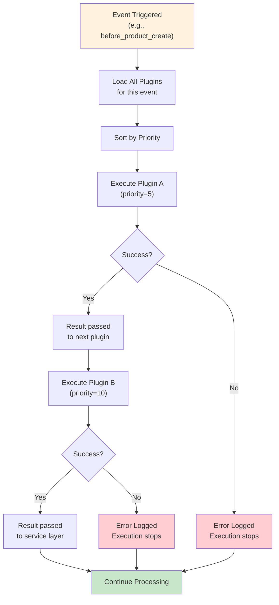

**Plugin Priority Order:**
- Priority 1, 5, 10, 20, etc. (lower = earlier)
- Each plugin receives output from previous
- Can modify or validate data
- Errors stop chain (for before hooks)

## UI Component Resolution

### Admin Dashboard Component Loading

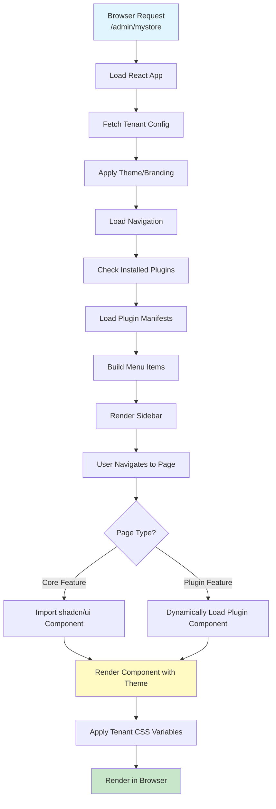

### Plugin Component Mount

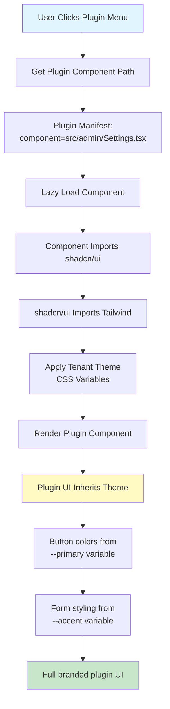

**Theme Variable Flow:**
```
Tenant Branding (Database)
    ↓
useTheme() Hook
    ↓
CSS Variables (--primary, --accent, etc.)
    ↓
Tailwind Classes
    ↓
Component Styling
```

## Data Flow Examples

### Product Creation with Plugins

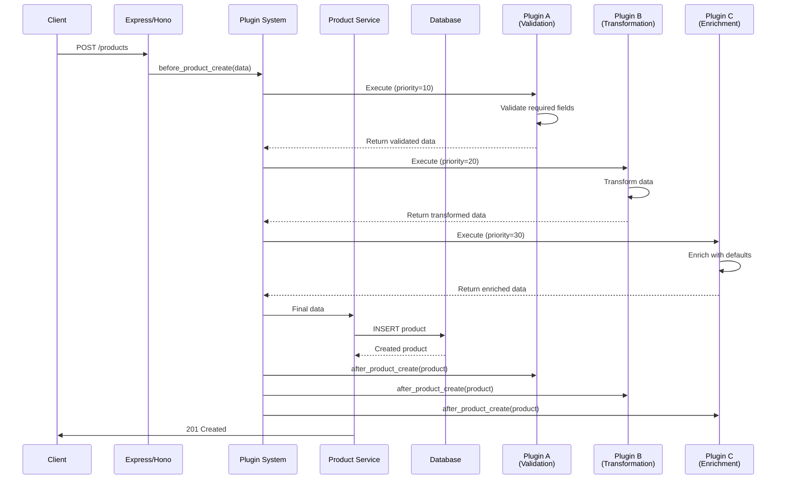

### Order Fulfillment Workflow

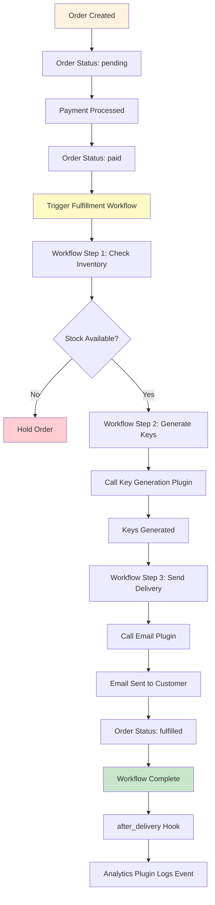

### Payment Processing with Gateway

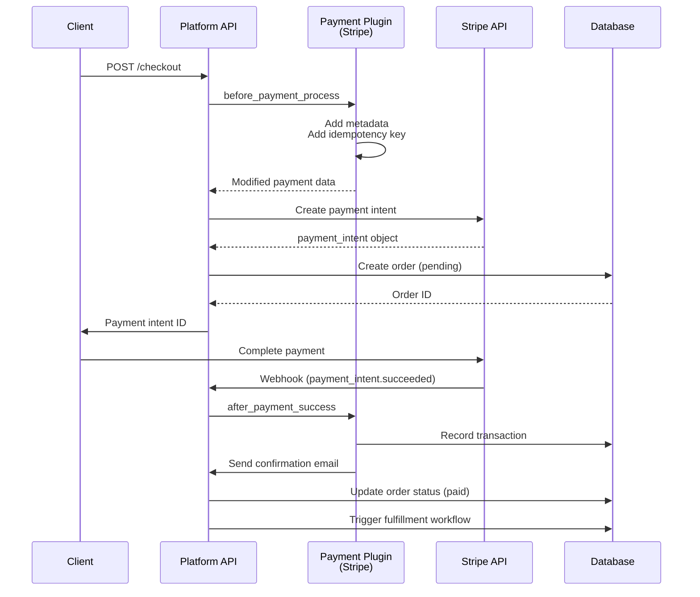

## Runtime Comparison

### Performance Characteristics

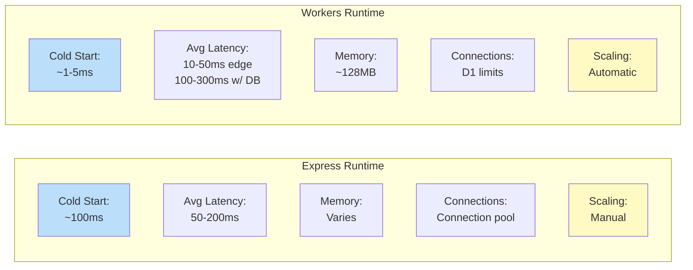

### Feature Comparison

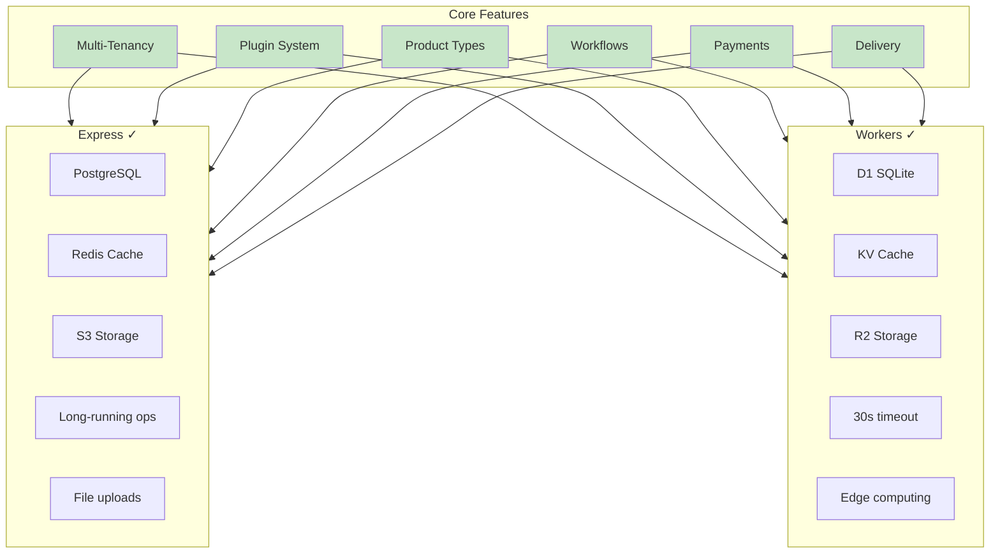

## Deployment Architecture

### Express Deployment

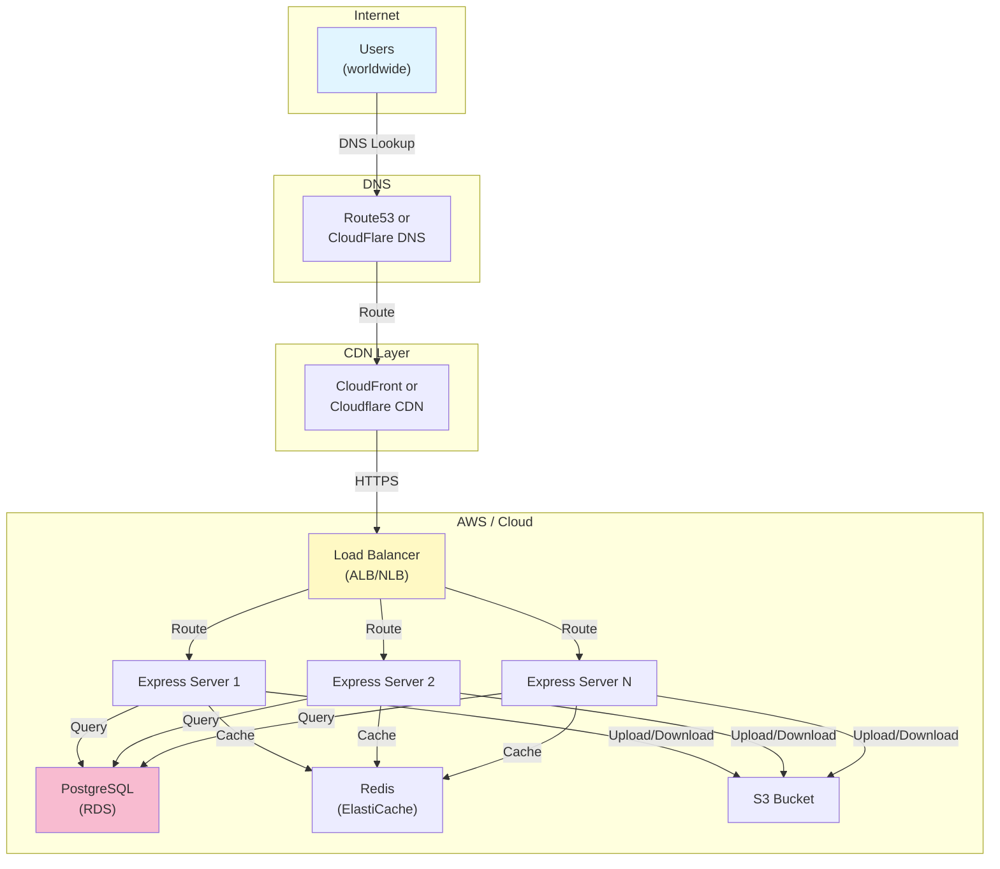

### Workers Deployment

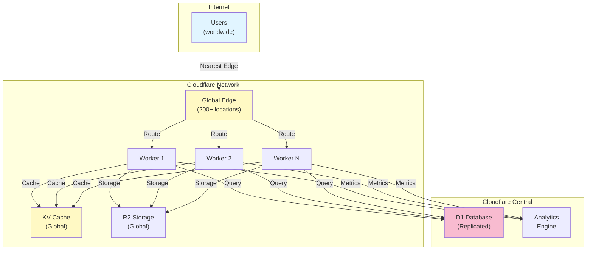

## Multi-Tenant Data Isolation

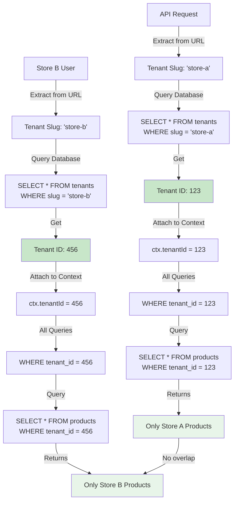

**Key Points:**
- Every row includes `tenant_id`
- Every query filters by `tenant_id`
- Zero possibility of cross-tenant data leakage
- Multi-tenant database on single PostgreSQL/D1

## References

For more details on each component:
- [Cloudflare Migration Guide](./cloudflare-migration.md) - Architecture details
- [Cloudflare Dev Setup](./cloudflare-dev-setup.md) - Runtime differences
- [ARCHITECTURE.md](../ARCHITECTURE.md) - System design
- [Plugin Development Guide](./plugin-development.md) - Plugin architecture
