# MTC Platform - Architecture Documentation

## System Overview

The MTC Platform is a flexible, multi-tenant digital commerce solution that supports ANY type of digital products through a combination of:

1. **Multi-Tenant Architecture** - Complete data isolation with shared infrastructure
2. **Plugin System** - Extensible hooks for all major events
3. **Zero Hardcoding** - Database-driven configuration for all entities
4. **Dynamic Product Types** - Define product types on-the-fly with custom fields
5. **EAV Pattern** - Entity-Attribute-Value for flexible product attributes
6. **Dual Runtime Support** - Both Express.js (traditional) and Cloudflare Workers (edge computing)

## Core Principles

### 1. Multi-Tenancy
Every operation is scoped to a tenant:
- Tenant resolution from URL slug or domain
- Row-level security through tenant_id filtering
- Separate settings, branding, and plugins per tenant
- Admin per store + Super admin for platform

### 2. Zero Hardcoding
Everything configurable via API/UI:
- Product types defined in `product_types` table with JSON schema
- Workflows stored as JSON with step definitions
- Delivery methods with configurable templates
- Pricing rules with flexible conditions
- All settings in JSONB fields

### 3. Plugin Architecture
Extensibility through:
- **Hooks**: before/after events for products, orders, payments, etc.
- **API Endpoints**: Plugins can register custom endpoints
- **Admin UI**: Custom React components for plugin settings
- **Database**: Plugins can add migrations
- **Manifest-Based**: All plugin metadata in plugin.json

### 4. Dynamic Product Types
Product types stored as JSON schemas:
```json
{
  "fields": [
    {
      "name": "title",
      "type": "text",
      "label": "Product Title",
      "required": true,
      "validation": { "minLength": 3, "maxLength": 255 }
    },
    {
      "name": "platform",
      "type": "select",
      "options": [
        { "value": "steam", "label": "Steam" },
        { "value": "epic", "label": "Epic Games" }
      ]
    }
  ]
}
```

### 5. EAV Pattern
For flexible attributes:
- `products` table: Core product data
- `product_attributes` table: Key-value pairs for custom fields
- `product_variants` table: Product variants with own attributes

## Runtime Architecture

### Express.js Runtime (Traditional)

**Deployment**: Self-hosted, Docker, traditional cloud providers

**Technology Stack:**
- HTTP Server: Express.js
- Database: PostgreSQL
- Cache: Redis (optional)
- File Storage: AWS S3 or local filesystem
- Execution Model: Long-running processes

**Advantages:**
- Familiar Node.js ecosystem
- Full control over infrastructure
- Suitable for complex, long-running operations
- Better for file upload/processing
- Lower latency for internal APIs

**Constraints:**
- Requires infrastructure management
- Higher operational overhead
- Scaling requires load balancers + multiple instances

### Cloudflare Workers Runtime (Edge Computing)

**Deployment**: Cloudflare Workers platform

**Technology Stack:**
- HTTP Server: Hono.js
- Database: D1 SQLite (Cloudflare's database)
- Cache: KV (Cloudflare Key-Value storage)
- File Storage: R2 (Cloudflare's S3-like storage)
- Execution Model: Serverless edge functions

**Advantages:**
- Global edge deployment (ultra-low latency)
- Automatic scaling
- No infrastructure management
- Pay-per-request pricing
- Built-in DDoS protection
- Instant cold starts

**Constraints:**
- 30-second request timeout
- Limited memory (~128MB)
- SQLite instead of PostgreSQL
- KV eventual consistency
- Cannot run blocking operations

### Request Flow Comparison

**Express Runtime:**
```
Client Request
    ↓
Load Balancer
    ↓
Express Server(s)
    ↓
PostgreSQL Database
    ↓
Redis Cache (optional)
    ↓
S3 Storage
    ↓
Response to Client
```

**Workers Runtime:**
```
Client Request
    ↓
Cloudflare Edge Network (globally distributed)
    ↓
Hono Worker (nearest edge location)
    ↓
D1 SQLite (centralized, replicated)
    ↓
KV Cache (global, edge-located)
    ↓
R2 Storage (global, edge-replicated)
    ↓
Response to Client (from nearest edge)
```

## Database Design

### Multi-Tenant Core
```
tenants
├── id (UUID)
├── slug (unique, URL-friendly)
├── name
├── domain (custom domain)
├── subdomain (multi-domain support)
├── status (active/suspended/deleted)
├── plan (free/basic/pro/enterprise)
├── settings (JSONB - all store config)
├── branding (JSONB - colors, logos, fonts)

tenant_users
├── tenant_id
├── user_id
├── role
├── permissions (JSONB)
```

### Product System
```
product_types (define structure)
├── tenant_id
├── slug
├── schema (JSONB - field definitions)
├── ui_config (JSONB - admin form layout)
├── workflows (JSONB - default workflows)

products (instances)
├── tenant_id
├── product_type_id
├── name, slug, status
├── metadata (JSONB - base fields)

product_attributes (EAV pattern)
├── product_id
├── attribute_key
├── attribute_value (JSONB)
├── attribute_type

product_variants
├── product_id
├── sku
├── attributes (JSONB)
├── price_data (JSONB)
├── inventory_data (JSONB)
├── delivery_data (JSONB)
```

### Plugin System
```
plugins (available plugins)
├── slug, name, version
├── manifest (JSONB - hooks, endpoints, permissions)
├── status (available/installed/active/deprecated)

tenant_plugins (per-tenant installation)
├── tenant_id
├── plugin_id
├── status (active/inactive)
├── config (JSONB - plugin settings)

plugin_hooks (hook registrations)
├── plugin_id
├── hook_name
├── handler_function
├── priority
```

### Workflow System
```
workflows
├── tenant_id
├── name
├── entity_type (order, product, user)
├── trigger (on_create, on_update, on_status_change, scheduled)
├── steps (JSONB array - step definitions)

workflow_executions (execution tracking)
├── workflow_id
├── entity_id
├── status (pending, running, completed, failed)
├── execution_data (JSONB - runtime context)
```

### Delivery System
```
delivery_methods
├── tenant_id
├── type (email, webhook, file, manual, plugin)
├── config (JSONB - method-specific config)
├── template (JSONB - message/payload template)

deliveries (delivery tracking)
├── order_id
├── order_item_id
├── delivery_method_id
├── status (pending, processing, delivered, failed)
├── delivery_data (JSONB - keys, links, etc.)
├── error_log (JSONB - error tracking)
```

### Pricing System
```
pricing_rules
├── entity_type (product, category, global)
├── rule_type (role_based, quantity, time_based, subscription)
├── conditions (JSONB - when to apply)
├── price_modifier (JSONB - how to modify)
├── priority

user_roles
├── tenant_id
├── name, slug
├── permissions (JSONB)
├── pricing_tier
```

### Orders
```
orders
├── tenant_id
├── user_id
├── order_number
├── status
├── items_data (JSONB - denormalized for performance)
├── pricing_data (JSONB - price breakdown)
├── payment_data (JSONB - payment details)
├── customer_data (JSONB - customer info)

order_items
├── order_id
├── product_id
├── variant_id
├── quantity
├── unit_price
├── delivery_status
```

## API Architecture

### Routing Structure
```
/api/admin
  /tenants                    - Super admin tenant management

/api/{tenant_slug}/admin
  /product-types              - Product type management
  /products                   - Product CRUD
  /workflows                  - Workflow builder
  /delivery-methods           - Delivery configuration
  /plugins                    - Plugin management
  /orders                     - Order management
  /integrations              - Integration management
  /payment-gateways          - Payment gateway configuration

/api/{tenant_slug}/storefront
  /products                   - Customer product listing
  
/api/{tenant_slug}/plugins
  /{plugin_name}/hooks/{hook_name}  - Plugin endpoints
  /{plugin_name}/webhook            - Webhook endpoints
```

### Request/Response Format
```json
{
  "success": true,
  "data": { /* actual response data */ },
  "message": "Optional success message"
}
```

Error responses:
```json
{
  "success": false,
  "error": "Error message",
  "statusCode": 400
}
```

### Authentication
- **Admin**: JWT with admin user claims
- **Tenant**: JWT with user claims + tenant_id
- **Public**: No auth needed for storefront product listing

### Tenant Resolution
1. Extract tenant_slug from URL params
2. Query `tenants` table by slug
3. Verify status = 'active'
4. Attach tenant object to request
5. Use tenant_id for all subsequent queries

## Service Layer

### TenantService
- CRUD operations on tenants
- Settings management
- Branding configuration

### ProductTypeService
- Create/manage product type definitions
- Schema validation
- UI configuration

### ProductService
- Product CRUD
- EAV attribute management
- Product variants

### PluginService
- Plugin installation/uninstallation
- Configuration management
- Activation/deactivation

### WorkflowService
- Workflow CRUD
- Workflow execution tracking
- Step management

### DeliveryService
- Delivery method CRUD
- Template management
- Delivery tracking

### OrderService
- Order CRUD
- Order item management
- Order tracking

### IntegrationService
- Integration CRUD
- Field mapping
- Webhook configuration

### PaymentService
- Payment gateway CRUD
- Credential management
- Transaction tracking

## Middleware Stack

### 1. Security
```typescript
helmet()              // Security headers
cors()               // CORS configuration
express.json()       // JSON parsing with size limits
```

### 2. Tenant Resolution
```typescript
resolveTenant()              // From URL slug
resolveTenantByDomain()      // From domain header
```

### 3. Authentication
```typescript
verifyAdminToken()           // Admin JWT verification
verifyTenantToken()          // Tenant JWT verification
optionalTenantToken()        // Optional auth (storefront)
```

### 4. Error Handling
```typescript
errorHandler()              // Centralized error handling
```

## Error Handling

### Error Classes
```typescript
AppError(statusCode, message)           // Base error
ValidationError(message)                // 400
NotFoundError(message)                  // 404
UnauthorizedError(message)              // 401
ForbiddenError(message)                 // 403
ConflictError(message)                  // 409
```

### Error Flow
1. Middleware/Route throws error
2. Express catches it via express-async-errors
3. errorHandler middleware processes it
4. Sends standardized JSON response

## Plugin System Architecture

### Plugin Lifecycle
1. **Registration**: Plugin manifest loaded
2. **Installation**: Plugin installed to tenant
3. **Activation**: Plugin hooks registered
4. **Execution**: Hooks called at appropriate times
5. **Deactivation**: Plugin hooks unregistered

### Hook System
```typescript
// Hook signature
export default async function hookName(ctx: PluginContext, data: any) {
  // Can modify data (before hooks) or trigger actions (after hooks)
  return data;  // Before hooks return modified data
  // After hooks don't return, just trigger actions
}
```

### Hook Execution
- Hooks stored with priority (lower = earlier execution)
- Multiple plugins can hook same event
- Executed in order of priority
- After hooks: executed asynchronously
- Before hooks: must complete before proceeding

### Plugin Context
```typescript
interface PluginContext {
  store: Tenant
  tenantId: string
  plugin: TenantPlugin
  db: DatabaseAccess
  events: EventEmitter
  http: HttpClient
  email: EmailService
  cache: CacheService
  queue: JobQueue
  plugins: PluginManager
  logger: Logger
}
```

## Data Flow Examples

### Creating a Product
1. Client POSTs to `/api/{tenant}/admin/products`
2. JWT verified, tenant resolved
3. ProductService.createProduct() called
4. Product inserted into products table
5. Product attributes set (EAV pattern)
6. before_product_create hook called
7. Product returned to client

### Processing a Payment
1. Client requests payment processing
2. before_payment_process hook called
3. Stripe plugin receives hook, validates payment
4. Stripe payment intent created
5. Client completes payment
6. Webhook received from Stripe
7. after_payment_success hook called
8. Order status updated
9. Delivery workflow triggered
10. Email delivery method sends keys

### Executing a Workflow
1. Trigger event occurs (e.g., order.created)
2. Workflow fetched from database
3. Execution created (workflow_executions)
4. Steps executed sequentially
5. Conditions evaluated for branching
6. Actions executed (email, webhook, etc.)
7. Execution status updated
8. Completed/failed marked

## Scalability Considerations

### Horizontal Scaling
- Stateless API servers
- Load balancer distributes requests
- Database connection pooling (PgBounce)
- Session storage in Redis (can be added)

### Vertical Scaling
- Database indexes on hot columns
- JSONB fields indexed efficiently
- Connection pool tuning
- Query optimization

### Caching
- Redis integration ready
- Session caching
- Query result caching
- Plugin output caching

### Performance Optimization
- Database indexes on:
  - tenant_id (every query)
  - slug fields (lookups)
  - status fields (filtering)
  - created_at (sorting)
- JSONB operators for efficient queries
- Pagination for large result sets

## Security Architecture

### Tenant Isolation
- Every query filters by tenant_id
- Cannot cross-tenant operations
- Row-level security ready

### Authentication
- JWT tokens (no session state)
- Separate secrets for admin/tenant
- Token expiration enforced

### Authorization
- Role-based permissions
- Permission checks in middleware
- Plugin permission system

### Data Protection
- Credentials encrypted (can be added)
- HTTPS required in production
- SQL injection prevention (parameterized)
- CORS configured

## Workers Runtime Considerations

### Performance Optimization

**30-Second Timeout Limit:**
- All requests must complete within 30 seconds
- Batch database queries to minimize round trips
- Use pagination for large result sets
- Defer heavy operations to background jobs
- Stream large responses instead of buffering

**Memory Constraints:**
- ~128MB shared memory per Worker
- Don't load large datasets into memory
- Stream files instead of buffering
- Implement garbage collection strategies
- Use KV for temporary storage

**CPU Time Limits:**
- Limited CPU time per request (~50ms average)
- Avoid complex computations (crypto, image processing)
- Use database queries for filtering/sorting (push logic down)
- Cache computed results in KV
- Offload heavy tasks to external services

### D1 SQLite Differences

**Key differences from PostgreSQL:**
- Different JSON functions: `json_extract` vs `jsonb_extract_path`
- No native array types (use JSON)
- Limited date/time functions
- No CASCADE DELETE (must handle in application)
- No prepared statement support (D1Adapter handles this)

**Mitigation:**
- D1Adapter (`src/config/d1-database.ts`) provides pg-promise-like API
- Abstracts database differences for service layer
- Both runtimes use identical service code

### KV Cache Model

**Eventual Consistency:**
- KV writes may not immediately read back
- Use database for authoritative data
- Good for: sessions, cache, temporary state
- Not good for: financial transactions, order status

**TTL Management:**
- KV automatically expires keys with TTL
- Set reasonable TTLs to avoid stale data
- Implement refresh logic for important caches

## Integration Points

### Third-Party Services
- **Payment Gateways**: Stripe, PayPal, etc.
- **Email Services**: SendGrid, Mailgun, etc.
- **Storage**: AWS S3, Google Cloud Storage, Cloudflare R2
- **Analytics**: Segment, Mixpanel
- **CRM**: Salesforce, HubSpot

### External APIs
- Webhooks from payment providers
- Sync from product providers
- Push to fulfillment services
- Rate-limited to avoid timeout

### Custom Integrations
- Field mapping for data transformation
- Webhook configuration per integration
- Sync scheduling (cron expressions)
- Error handling and retry logic

## Deployment Architecture

### Development
- Local PostgreSQL
- Node dev server (with reload)
- TypeScript compilation on-the-fly

### Production
- Docker container
- Managed PostgreSQL (RDS, Cloud SQL)
- Load balancer (ALB, nginx)
- Redis for caching
- CDN for static assets
- SSL/TLS termination

### Monitoring
- Application logs
- Database query logs
- Error tracking (Sentry)
- Performance monitoring (New Relic)
- Uptime monitoring

## UI Template System

### Overview
The UI Template system provides flexible, tenant-customizable frontend experiences through a component-based architecture.

### Core Tables

#### ui_themes
Defines visual styling (colors, fonts, spacing):
```
- id (UUID, PK)
- tenant_id (FK to tenants, nullable for system themes)
- name (e.g., "Default Theme", "Dark Mode")
- slug (unique per tenant)
- is_default (boolean)
- is_system (boolean, for platform defaults)
- colors (JSONB: primary, secondary, background, etc.)
- fonts (JSONB: heading, body, mono)
- spacing (JSONB: scale, unit)
- borders (JSONB)
- shadows (JSONB)
```

#### ui_layouts
Defines page structure and regions:
```
- id (UUID, PK)
- tenant_id (FK to tenants, nullable for system layouts)
- plugin_id (FK to plugins, nullable)
- name (e.g., "Dashboard Layout", "Two Column")
- slug (unique per tenant)
- type (e.g., "page", "modal", "panel")
- is_system (boolean)
- grid_config (JSONB: columns, gap, rows)
- regions (JSONB array: [{name, width, height}])
- responsive_config (JSONB: breakpoints)
```

#### ui_components
Reusable UI building blocks:
```
- id (UUID, PK)
- tenant_id (FK to tenants, nullable for system components)
- plugin_id (FK to plugins, nullable - plugins can contribute)
- name (e.g., "Stats Card", "Product List")
- slug (unique per tenant)
- type (e.g., "widget", "chart", "form")
- category (e.g., "dashboard", "analytics")
- is_system (boolean)
- props_schema (JSONB: JSON Schema for component props)
- default_props (JSONB: default values)
- render_config (JSONB: styling, templates)
- dependencies (JSONB array: other component IDs)
```

#### ui_widgets
Configured component instances for pages:
```
- id (UUID, PK)
- tenant_id (FK to tenants)
- component_id (FK to ui_components)
- page (e.g., "dashboard", "products", "orders")
- region (e.g., "header", "sidebar", "main")
- position (integer, for ordering within region)
- props (JSONB: component configuration)
- visibility_rules (JSONB: role/permission conditions)
- is_active (boolean)
```

#### ui_templates
Complete page configurations:
```
- id (UUID, PK)
- tenant_id (FK to tenants, nullable for system templates)
- plugin_id (FK to plugins, nullable - plugins can provide)
- page (unique per tenant)
- name (e.g., "Dashboard Page", "Product Catalog")
- layout_id (FK to ui_layouts)
- theme_id (FK to ui_themes)
- is_default (boolean)
- is_system (boolean)
- override_config (JSONB: layout/theme overrides)
```

### Template Resolution

When a page is requested:
1. **Fetch template**: Query `ui_templates` by page + tenant_id
2. **Resolve layout**: Load associated `ui_layouts` record
3. **Resolve theme**: Load associated `ui_themes` record, merge tenant branding
4. **Load widgets**: Query `ui_widgets` for page, ordered by region + position
5. **Load components**: For each widget, fetch `ui_components` definition
6. **Merge overrides**: Apply `override_config` from template
7. **Check visibility**: Filter widgets by user role/permissions

### Tenant Customization

Tenants can:
- **Create themes**: Custom color schemes matching brand
- **Override layouts**: Create tenant-specific layouts
- **Add widgets**: Position components on pages
- **Configure props**: Customize widget behavior per page
- **Set visibility**: Show/hide widgets by role

System templates/themes/components serve as defaults.

### Plugin Contributions

Plugins can provide:
- **Components**: Via `plugin_id` in `ui_components`
- **Layouts**: Via `plugin_id` in `ui_layouts`
- **Templates**: Via `plugin_id` in `ui_templates`

Example: A "Stripe Analytics" plugin adds:
- Component: `stripe-revenue-chart`
- Widget: Placed on dashboard/main region
- Data binding: Fetches Stripe metrics via plugin hooks

### Response Example

Resolved template for "dashboard" page:
```json
{
  "id": "abc123",
  "page": "dashboard",
  "layout": {
    "regions": [
      { "name": "header", "width": "100%" },
      { "name": "main", "width": "1fr" }
    ],
    "grid_config": { "columns": 12 }
  },
  "theme": {
    "colors": {
      "primary": "#3b82f6",
      "background": "#ffffff"
    },
    "fonts": {
      "body": "Inter, sans-serif"
    }
  },
  "widgets": [
    {
      "id": "w1",
      "region": "main",
      "position": 0,
      "component": {
        "slug": "stats-card",
        "type": "widget"
      },
      "props": {
        "title": "Total Products",
        "value": "42",
        "icon": "📦"
      }
    }
  ]
}
```

### Caching Strategy

- **System templates**: Cached indefinitely (no tenant_id)
- **Tenant templates**: Cache per tenant, invalidate on update
- **Resolved templates**: Short TTL (5 min), full page config
- **Theme with branding**: Cache invalidated on tenant branding update

## Future Extensibility

### Ready For
- Event sourcing (audit trail)
- Messaging queue (Bull, RabbitMQ)
- Real-time updates (WebSockets)
- Batch jobs (background workers)
- Machine learning (recommendations)
- Analytics (reporting engine)
- Mobile APIs (native apps)
- GraphQL layer
- API versioning

### Potential Enhancements
- Role-based access control (RBAC)
- Audit logging
- Multi-language support (i18n)
- A/B testing framework
- Content management system
- Marketing automation
- Subscription management
- Affiliate system

---

## Architecture Diagrams

Visual flowcharts and diagrams illustrating system architecture, request flow, and key processes.

### Request Flow

#### Workers Request Flow (Edge Computing)

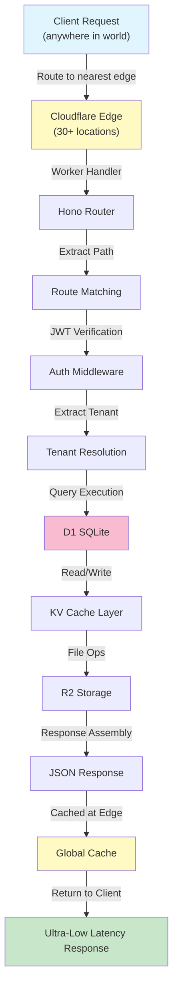

**Key Points:**
- Request handled at edge closest to user
- D1 database is centralized (request goes to DB region)
- KV cache is distributed (cache at each edge)
- Response returns from nearest edge location

#### Express Request Flow (Traditional)

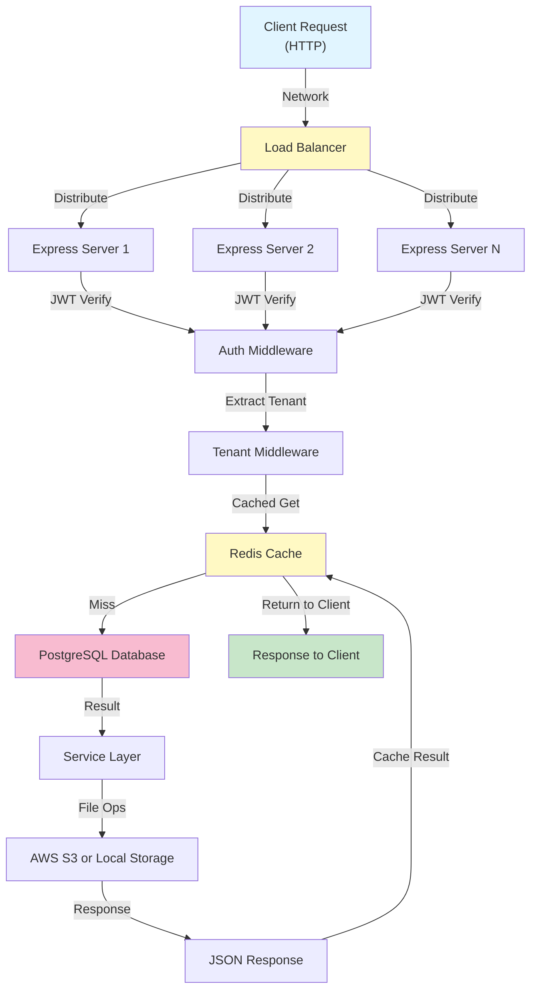

**Key Points:**
- Multiple Express instances behind load balancer
- Redis provides in-process cache
- All instances access same PostgreSQL
- Horizontal scaling via more instances

### Plugin Lifecycle

#### Plugin Installation & Activation

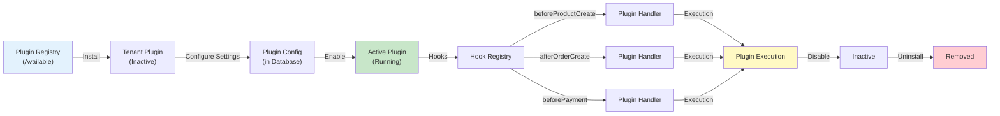

#### Plugin Execution Flow

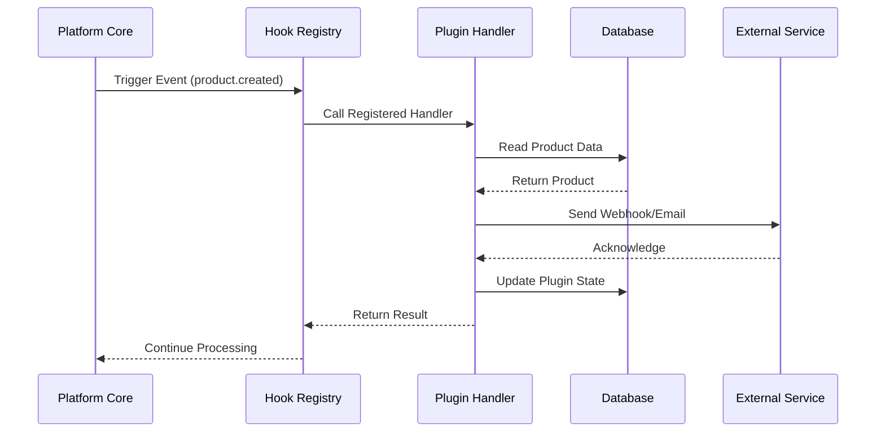

### Data Flow Examples

#### Multi-Tenant Data Isolation

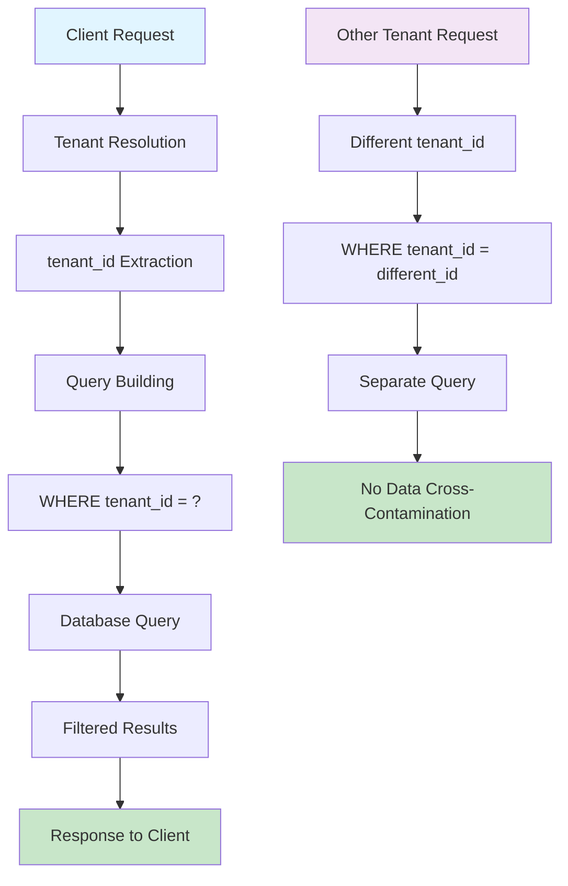

#### Plugin Data Flow

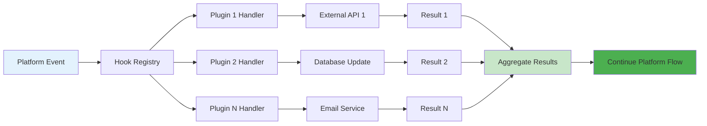

### Runtime Comparison

#### Performance Characteristics

| Feature | Express Runtime | Workers Runtime |
|----------|----------------|-----------------|
| **Latency** | 50-200ms | 10-50ms |
| **Scaling** | Manual/Auto-scaling | Automatic |
| **Geography** | Single region | Global edge |
| **Database** | PostgreSQL | D1 SQLite |
| **Cache** | Redis | KV Storage |
| **Storage** | S3/Local | R2/Local |
| **Cold Start** | N/A | 0-5ms |
| **Memory Limit** | Configurable | 128MB |
| **CPU Limit** | Configurable | 50ms CPU-time |
| **Concurrent Requests** | High | Very High |

#### Deployment Architecture

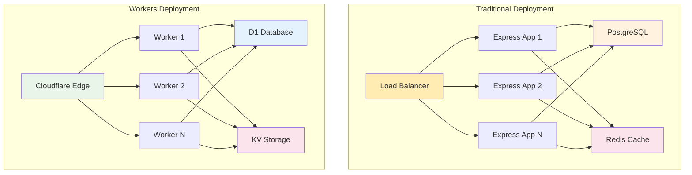

### Security Architecture

#### Authentication & Authorization Flow

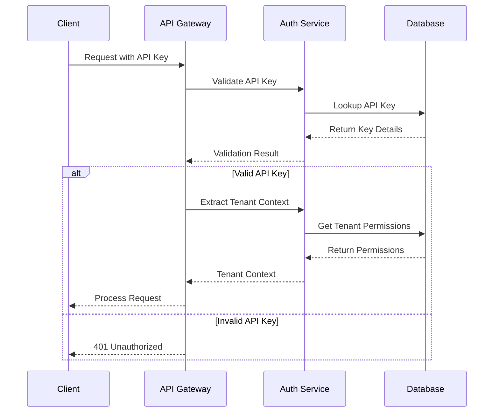

#### Multi-Tenant Security Layers

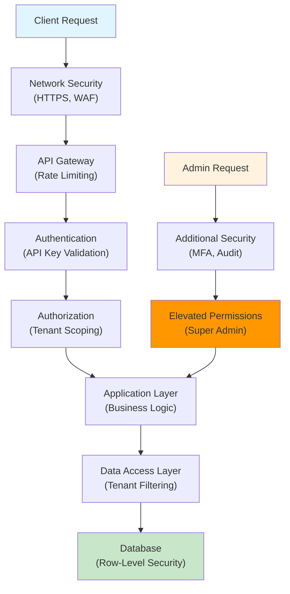

### Plugin Architecture

#### Plugin System Components

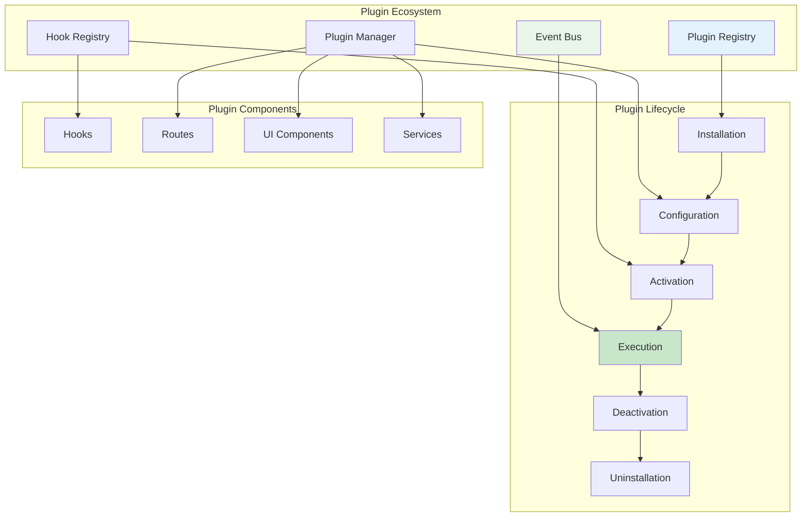

#### Plugin Hook System

```mermaid
graph LR
    A["Platform Event"] --> B["Hook Dispatcher"]
    B --> C["Priority Sorting"]
    C --> D["Plugin Hook 1<br/>(Priority: 10)"]
    C --> E["Plugin Hook 2<br/>(Priority: 5)"]
    C --> F["Plugin Hook N<br/>(Priority: 1)"]
    
    D --> G["Execution 1"]
    E --> H["Execution 2"]
    F --> I["Execution N"]
    
    G --> J["Result 1"]
    H --> K["Result 2"]
    I --> L["Result N"]
    
    J --> M["Aggregate Results"]
    K --> M
    L --> M
    M --> N["Continue Platform Flow"]
    
    alt Hook Returns Error
        M --> O["Error Handling"]
        O --> P["Rollback if Needed"]
    else All Hooks Success
        M --> N
    end
    
    style A fill:#e3f2fd
    style M fill:#c8e6c9
    style N fill:#4caf50
    style O fill:#f44336
```

### Database Architecture

#### Multi-Tenant Database Design

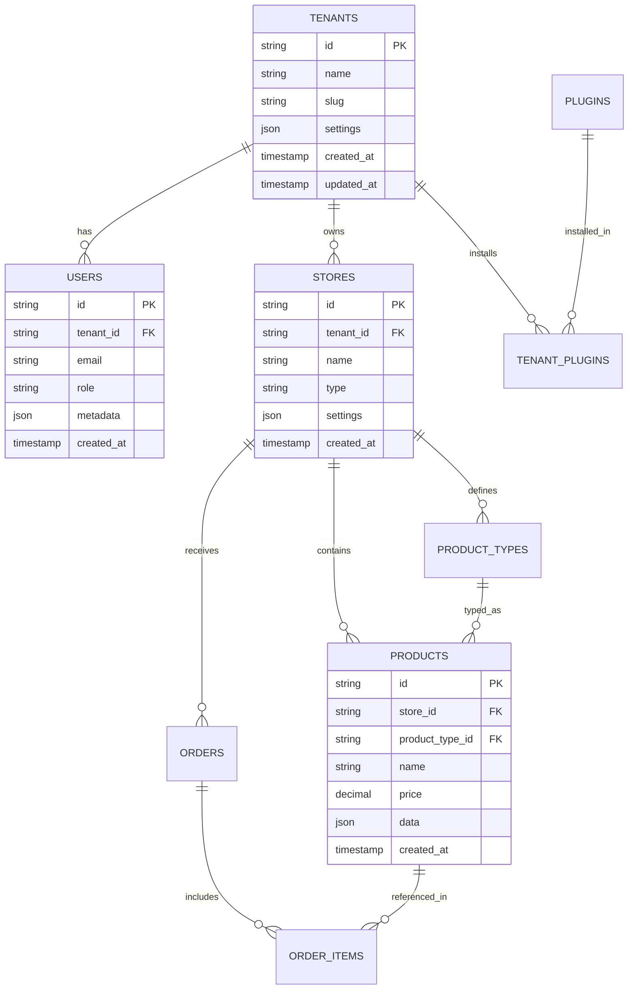

#### Plugin Data Storage

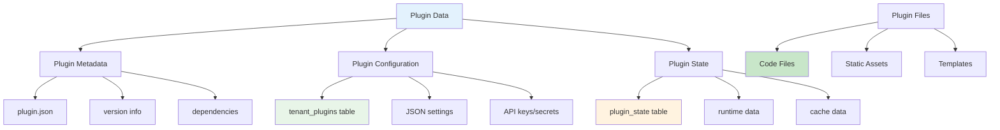

These diagrams provide a comprehensive visual understanding of the MTC Platform's architecture, from high-level request flows to detailed component interactions. They serve as reference guides for developers, architects, and system administrators working with the platform.
